## 一款看漫画的app

最新版本：

v1.11

## 更新信息

### v1.11

<h3 id="1234567890v1.11">

1.漫画首页添加漫画加载中的提示

2.漫画图片显示更全

3.添加用户数据更新功能

</h3>

 

 

### v1.10

<h3 id="1234567890v1.10">

1.适配安卓12

2.优化漫画更新推送功能

</h3>

 

 

### v1.9

<h3 id="1234567890v1.9">

1.新增备份和恢复功能

1.优化历史记录页面和漫画收藏夹页面的列表和图片的显示时机

1.历史记录页面和漫画界面添加正在加载的提示

</h3>

 

 

### v1.8

<h3 id="1234567890v1.8">

1.更改请求的url

</h3>

 

 

### v1.7

<h3 id="1234567890v1.7">

1.修复漫画更新推送服务因多线程并发问题导致的漫画更新章数可能为0的bug

2.开放漫画更新推送服务的API

3.漫画收藏夹页面已更新的漫画用其他颜色标注

4.将通知形式更改为长内容形式的通知

5.禁用横屏

6.漫画目录页面目录加载过程中显示正在加载的提示

7.漫画观看页面采用全屏显示，并适配刘海屏

8.漫画观看页面使用上下文菜单来代替选项菜单，并添加返回选项

9.添加了桌面图标快捷方式

10.漫画搜索页面2秒内只允许一次搜索请求

11.漫画搜索页面在漫画搜索过程中显示正在加载的提示

</h3>

 

 

### v1.6

<h3 id="1234567890v1.6">

1.优化漫画观看页面的代码

2.处理运行时异常

</h3>

 

 

### v1.5

<h3 id="1234567890v1.5">

1.优化线程池，增加救急线程的数量，减少核心线程的数量

2.由于图片保存在缓存目录，该目录的文件经常会被操作系统删除，重新加载需要消耗流量，所以我将图片的缓存目录由缓存目录更改到了普通目录，由用户自己管理

3.主菜单添加删除缓存的功能

4.搜索页面的输入框添加按回车键即可开启搜索的功能，点击回车后自动关闭输入法

5.搜索页面输入的关键字必须至少两个字

6.更改漫画观看页面历史记录追踪逻辑加载的优先级，优化代码

7.漫画观看页面添加正在加载的提示

8.漫画目录页面横屏和竖屏两套不同的布局

9.添加漫画更新推送服务，虽然知道这样做会对后端带来很大的压力，但还是这么做了，此服务一天只能运行一次

</h3>

 

 

### v1.4

<h3 id="1234567890v1.4">

1.修复进入漫画目录页面有一定概率闪退的问题，并发安全问题，使用JUC的CountDownLatch解决此并发问题

</h3>

 

 

### v1.3

<h3 id="1234567890v1.3">

1.修复点击给项目点赞的菜单选项后会退出程序的问题

2.优化后台更新服务

</h3>

 

 

### v1.2

<h3 id="1234567890v1.2">

1.添加观看完成后的逻辑，观看完成(读完最新章节)后返回到目录，点击到其它页面也会返回到目录

2.给漫画目录页面的大图也添加本地缓存，优先从本地缓存去取，而不是直接从资源服务器上加载，之前调错方法了，参数和返回值都一样

3.漫画目录页面支持显示正在观看的章节目录了，用其它颜色标注

4.软件添加软件更新检查功能，本人没有后端服务器和公网ip，使用的是github上的服务器，通过解析html来实现更新

5.主菜单页面添加一个给项目点赞的菜单选项实现更新

</h3>

 

 

## 如何获取安装包

点击下面的Releases进入下载，或者进入app->release目录，app-release.apk就是最新版本的安装包

# 界面效果

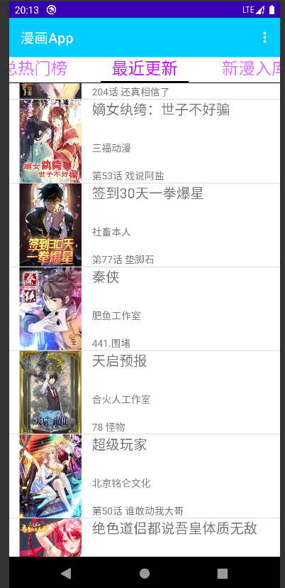

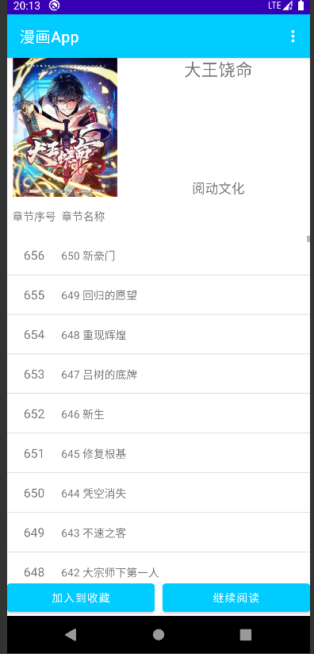

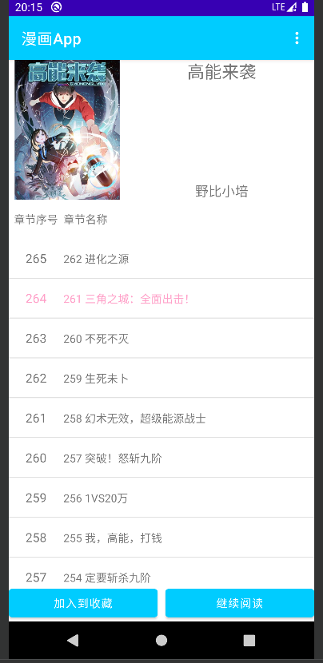

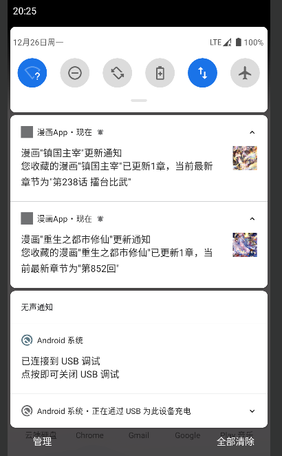

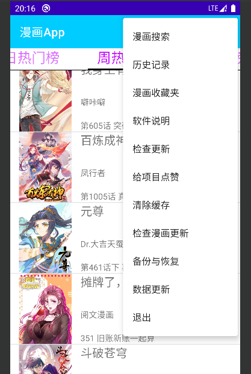

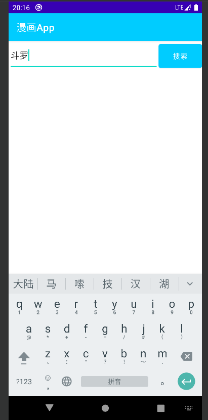

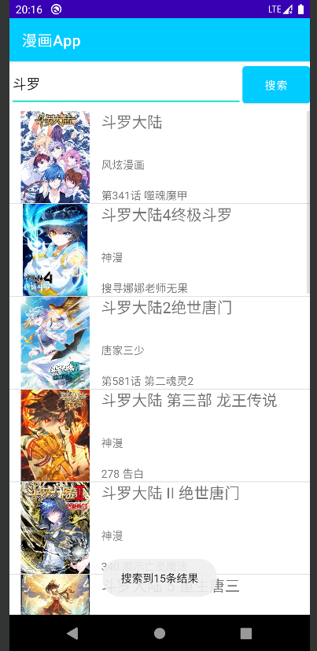

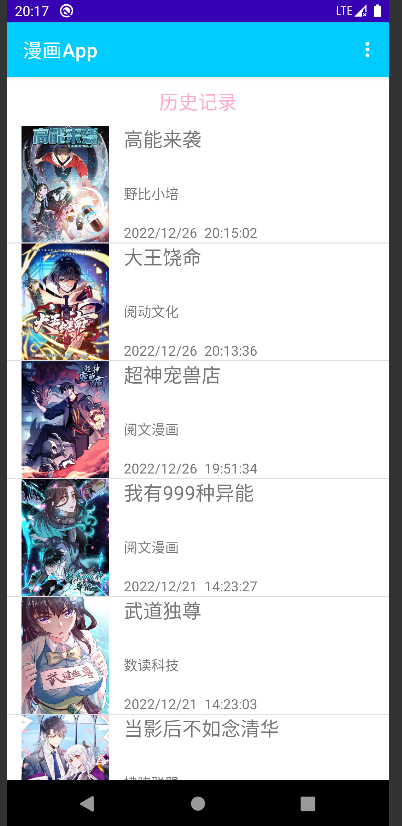

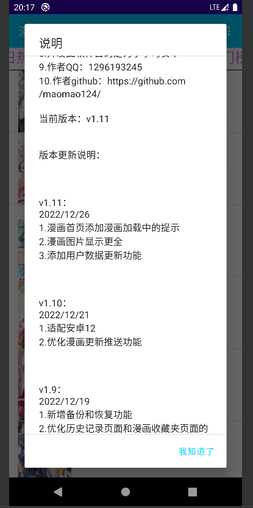

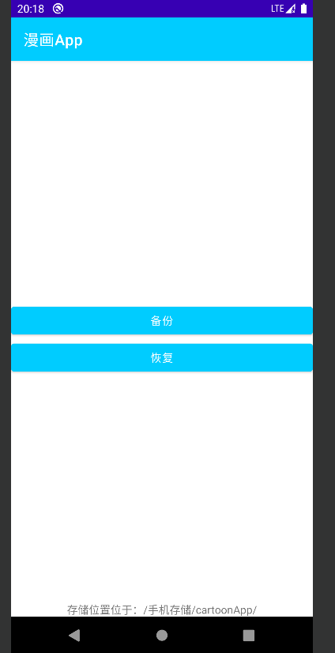

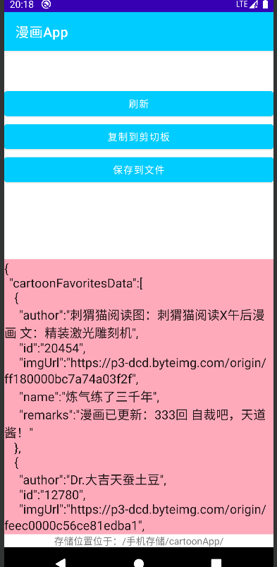

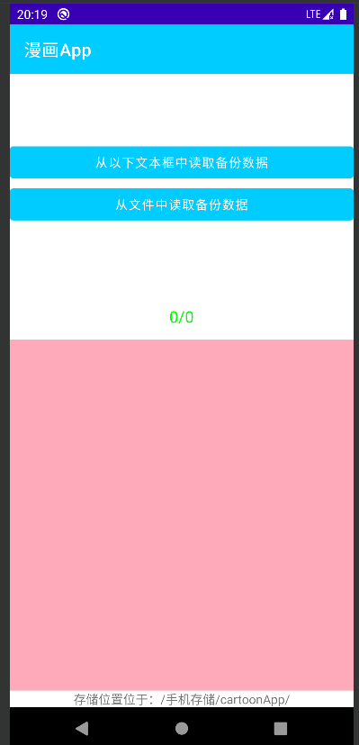

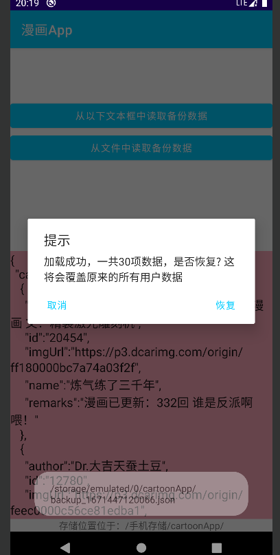

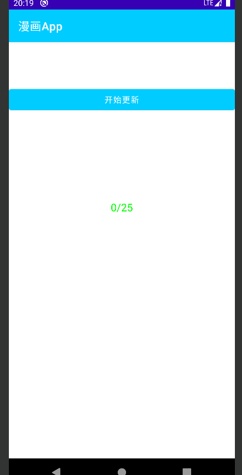

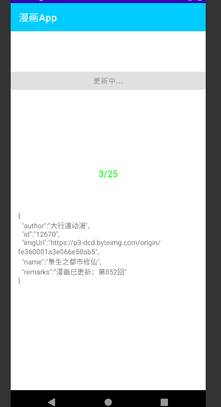

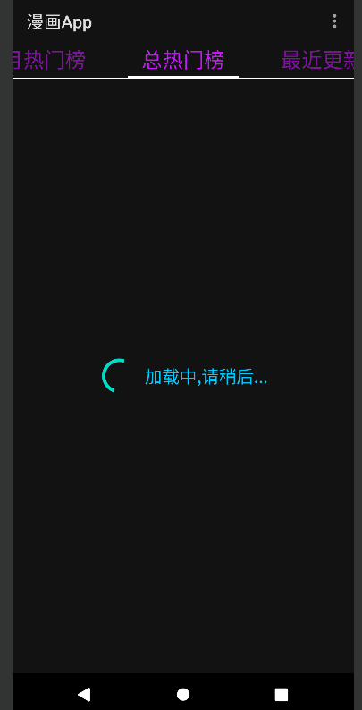

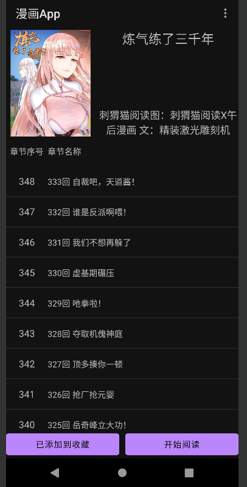

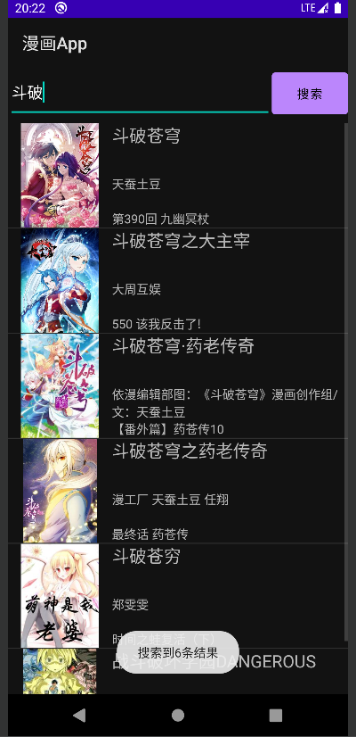

